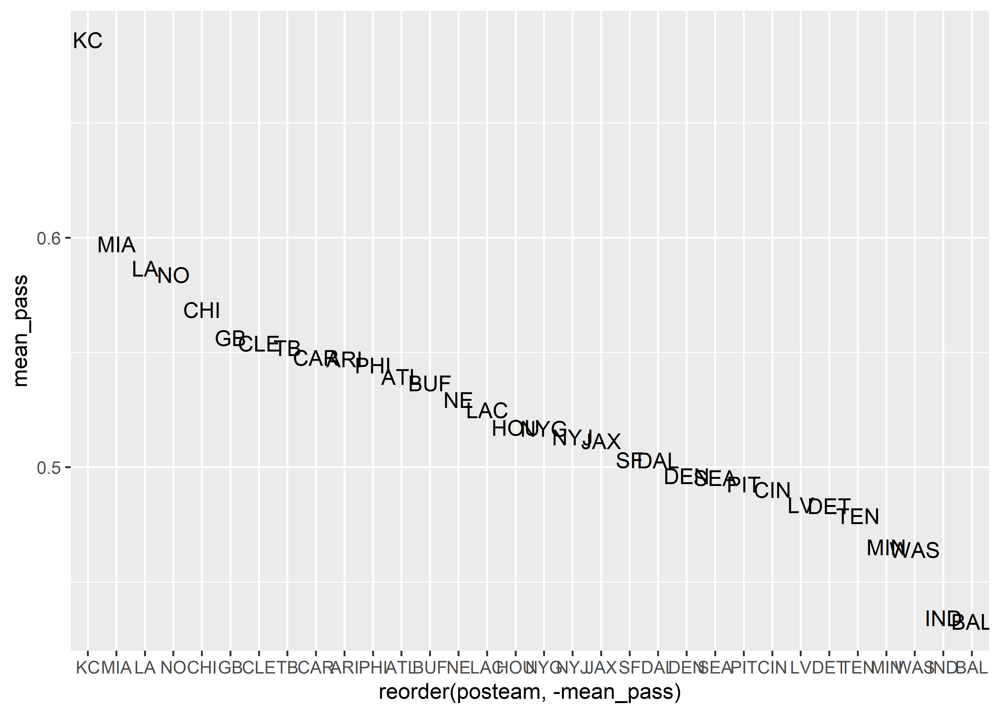
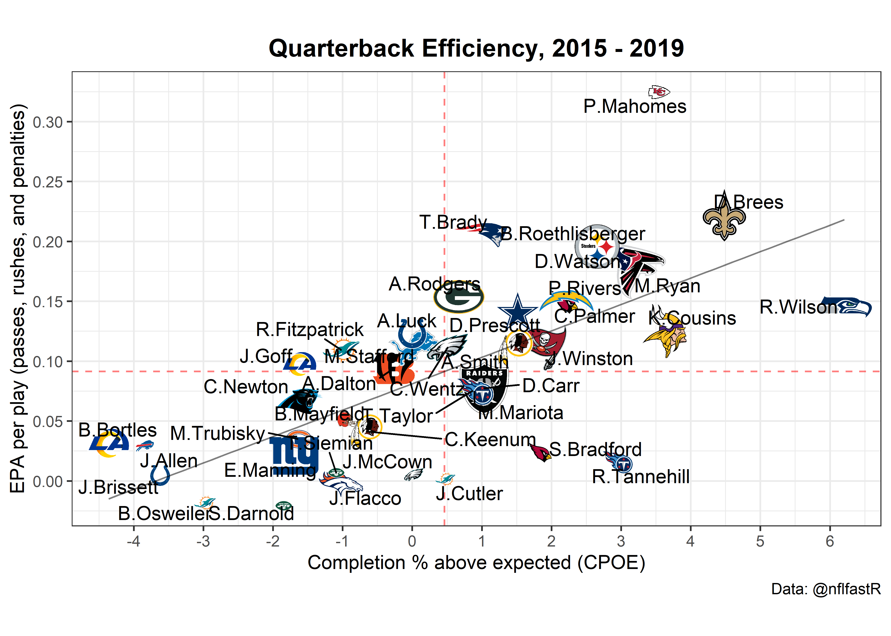

A beginner’s guide to nflfastR
================
Ben Baldwin

  - [Introduction](#introduction)
  - [Setup](#setup)
      - [Install packages](#install-packages)
      - [Load packages](#load-packages)
      - [Load data](#load-data)
  - [Basics: how to look at your data](#basics-how-to-look-at-your-data)
      - [Dimensions](#dimensions)
      - [Variable names](#variable-names)
      - [Viewer](#viewer)
      - [Head + manipulation](#head-manipulation)
  - [Some basic stuff: Part 1](#some-basic-stuff-part-1)
      - [Group by and Summarize](#group-by-and-summarize)
      - [Manipulating columns: mutate, if\_else, and
        case\_when](#manipulating-columns-mutate-if_else-and-case_when)
      - [A basic figure](#a-basic-figure)
  - [Loading multiple seasons](#loading-multiple-seasons)
  - [Figures with QB stats](#figures-with-qb-stats)
      - [With team color dots](#with-team-color-dots)
      - [With team logos](#with-team-logos)
  - [Real life example: let’s make a win total
    model](#real-life-example-lets-make-a-win-total-model)
      - [Get team wins each season](#get-team-wins-each-season)
      - [Get team EPA by season](#get-team-epa-by-season)
      - [Fix team names and join](#fix-team-names-and-join)
      - [Correlations and regressions](#correlations-and-regressions)
      - [Predictions](#predictions)
  - [Next Steps](#next-steps)
      - [Other code examples: R](#other-code-examples-r)
      - [More data sources](#more-data-sources)
      - [Other code examples: Python](#other-code-examples-python)

## Introduction

The following guide will assume you have R installed. I also highly
recommend working in RStudio. If you need help getting those installed
or are unfamiliar with how RStudio is laid out, [please see this section
of Lee Sharpe’s
guide](https://github.com/leesharpe/nfldata/blob/master/RSTUDIO-INTRO.md#r-and-rstudio-introduction).

A quick word if you’re new to programming: all of this is happening in
R. Obviously, you need to install R on your computer to do any of this.
Make sure you save what you’re doing in a script (in RStudio, File –\>
New File –\> R script) so you can save your work and run multiple lines
of code at once. To run code from a script, highlight what you want, and
press control + enter or press the Run button in the top of the editor
(see Lee’s guide). If you don’t highlight anything and press control +
enter, the currently selected line will run. As you go through your R
journey, you might get stuck and have to google a bunch of things, but
that’s totally okay and normal. That’s how I got started\!

## Setup

First, you need to install the magic packages. You only need to run this
step once on a given computer. For these you can just type them into the
RStudio console (look for the Console pane in RStudio) directly since
you’re never going to be doing this again.

### Install packages

``` r
install.packages("tidyverse")
install.packages("ggrepel")
install.packages("ggimage")

#needed to install `nflfastR`
install.packages("devtools")
devtools::install_github("mrcaseb/nflfastR")
```

### Load packages

Okay, now here’s the stuff you’re going to want to start putting into
your R script. The following loads `tidyverse`, which contains a lot of
helper functions for working with data, and `ggrepel` and `ggimage` for
making figures, along with `nflfastR`.

``` r
library(tidyverse)
library(ggrepel)
library(ggimage)
library(nflfastR)
```

This one is optional but makes R prefer not to display numbers in
scientific notation, which I find very annoying:

``` r
options(scipen = 9999)
```

### Load data

This will load the full play by play for the 2019 season (including
playoffs). We’ll get to how to get more seasons later. Note that this is
not actually using the `nflfastR` package, but downloading pre-cleaned
data from its data repository, which is much faster.

``` r
data <- readRDS(url('https://raw.githubusercontent.com/guga31bb/nflfastR-data/master/data/play_by_play_2019.rds'))
```

## Basics: how to look at your data

### Dimensions

Before moving forward, here are a few ways to get a sense of what’s in a
dataframe. We can check the **dim**ensions of the data, and this tells
us that there are 48,034 rows (i.e., plays) in the data and 322 columns
(variables):

``` r
dim(data)
#> [1] 48034   322
```

`str` displays the **str**ucture of the dataframe:

``` r
str(data[1:10])
#> tibble [48,034 x 10] (S3: tbl_df/tbl/data.frame)
#>  $ play_id      : num [1:48034] 1 36 51 79 100 121 148 185 214 239 ...
#>  $ game_id      : chr [1:48034] "2019_01_ATL_MIN" "2019_01_ATL_MIN" "2019_01_ATL_MIN" "2019_01_ATL_MIN" ...
#>  $ home_team    : chr [1:48034] "MIN" "MIN" "MIN" "MIN" ...
#>  $ away_team    : chr [1:48034] "ATL" "ATL" "ATL" "ATL" ...
#>  $ season_type  : chr [1:48034] "REG" "REG" "REG" "REG" ...
#>  $ week         : int [1:48034] 1 1 1 1 1 1 1 1 1 1 ...
#>  $ posteam      : chr [1:48034] NA "ATL" "ATL" "ATL" ...
#>  $ posteam_type : chr [1:48034] NA "away" "away" "away" ...
#>  $ defteam      : chr [1:48034] NA "MIN" "MIN" "MIN" ...
#>  $ side_of_field: chr [1:48034] NA "MIN" "ATL" "ATL" ...
```

In the above, I’ve added in the `[1:10]`, which selects only the first
10 columns, otherwise the list is extremely long (remember from above
that there are 322 columns\!).

### Variable names

Another very useful command is to get the `names` of the variables in
the data:

``` r
names(data)
#>   [1] "play_id"                             
#>   [2] "game_id"                             
#>   [3] "home_team"                           
#>   [4] "away_team"                           
#>   [5] "season_type"                         
#>   [6] "week"                                
#>   [7] "posteam"                             
#>   [8] "posteam_type"                        
#>   [9] "defteam"                             
#>  [10] "side_of_field"                       
#>  [11] "yardline_100"                        
#>  [12] "game_date"                           
#>  [13] "quarter_seconds_remaining"           
#>  [14] "half_seconds_remaining"              
#>  [15] "game_seconds_remaining"              
#>  [16] "game_half"                           
#>  [17] "quarter_end"                         
#>  [18] "drive"                               
#>  [19] "sp"                                  
#>  [20] "qtr"                                 
#>  [21] "down"                                
#>  [22] "goal_to_go"                          
#>  [23] "time"                                
#>  [24] "yrdln"                               
#>  [25] "ydstogo"                             
#>  [26] "ydsnet"                              
#>  [27] "desc"                                
#>  [28] "play_type"                           
#>  [29] "yards_gained"                        
#>  [30] "shotgun"                             
#>  [31] "no_huddle"                           
#>  [32] "qb_dropback"                         
#>  [33] "qb_kneel"                            
#>  [34] "qb_spike"                            
#>  [35] "qb_scramble"                         
#>  [36] "pass_length"                         
#>  [37] "pass_location"                       
#>  [38] "air_yards"                           
#>  [39] "yards_after_catch"                   
#>  [40] "run_location"                        
#>  [41] "run_gap"                             
#>  [42] "field_goal_result"                   
#>  [43] "kick_distance"                       
#>  [44] "extra_point_result"                  
#>  [45] "two_point_conv_result"               
#>  [46] "home_timeouts_remaining"             
#>  [47] "away_timeouts_remaining"             
#>  [48] "timeout"                             
#>  [49] "timeout_team"                        
#>  [50] "td_team"                             
#>  [51] "posteam_timeouts_remaining"          
#>  [52] "defteam_timeouts_remaining"          
#>  [53] "total_home_score"                    
#>  [54] "total_away_score"                    
#>  [55] "posteam_score"                       
#>  [56] "defteam_score"                       
#>  [57] "score_differential"                  
#>  [58] "posteam_score_post"                  
#>  [59] "defteam_score_post"                  
#>  [60] "score_differential_post"             
#>  [61] "no_score_prob"                       
#>  [62] "opp_fg_prob"                         
#>  [63] "opp_safety_prob"                     
#>  [64] "opp_td_prob"                         
#>  [65] "fg_prob"                             
#>  [66] "safety_prob"                         
#>  [67] "td_prob"                             
#>  [68] "extra_point_prob"                    
#>  [69] "two_point_conversion_prob"           
#>  [70] "ep"                                  
#>  [71] "epa"                                 
#>  [72] "total_home_epa"                      
#>  [73] "total_away_epa"                      
#>  [74] "total_home_rush_epa"                 
#>  [75] "total_away_rush_epa"                 
#>  [76] "total_home_pass_epa"                 
#>  [77] "total_away_pass_epa"                 
#>  [78] "air_epa"                             
#>  [79] "yac_epa"                             
#>  [80] "comp_air_epa"                        
#>  [81] "comp_yac_epa"                        
#>  [82] "total_home_comp_air_epa"             
#>  [83] "total_away_comp_air_epa"             
#>  [84] "total_home_comp_yac_epa"             
#>  [85] "total_away_comp_yac_epa"             
#>  [86] "total_home_raw_air_epa"              
#>  [87] "total_away_raw_air_epa"              
#>  [88] "total_home_raw_yac_epa"              
#>  [89] "total_away_raw_yac_epa"              
#>  [90] "wp"                                  
#>  [91] "def_wp"                              
#>  [92] "home_wp"                             
#>  [93] "away_wp"                             
#>  [94] "wpa"                                 
#>  [95] "home_wp_post"                        
#>  [96] "away_wp_post"                        
#>  [97] "vegas_wp"                            
#>  [98] "vegas_home_wp"                       
#>  [99] "total_home_rush_wpa"                 
#> [100] "total_away_rush_wpa"                 
#> [101] "total_home_pass_wpa"                 
#> [102] "total_away_pass_wpa"                 
#> [103] "air_wpa"                             
#> [104] "yac_wpa"                             
#> [105] "comp_air_wpa"                        
#> [106] "comp_yac_wpa"                        
#> [107] "total_home_comp_air_wpa"             
#> [108] "total_away_comp_air_wpa"             
#> [109] "total_home_comp_yac_wpa"             
#> [110] "total_away_comp_yac_wpa"             
#> [111] "total_home_raw_air_wpa"              
#> [112] "total_away_raw_air_wpa"              
#> [113] "total_home_raw_yac_wpa"              
#> [114] "total_away_raw_yac_wpa"              
#> [115] "punt_blocked"                        
#> [116] "first_down_rush"                     
#> [117] "first_down_pass"                     
#> [118] "first_down_penalty"                  
#> [119] "third_down_converted"                
#> [120] "third_down_failed"                   
#> [121] "fourth_down_converted"               
#> [122] "fourth_down_failed"                  
#> [123] "incomplete_pass"                     
#> [124] "touchback"                           
#> [125] "interception"                        
#> [126] "punt_inside_twenty"                  
#> [127] "punt_in_endzone"                     
#> [128] "punt_out_of_bounds"                  
#> [129] "punt_downed"                         
#> [130] "punt_fair_catch"                     
#> [131] "kickoff_inside_twenty"               
#> [132] "kickoff_in_endzone"                  
#> [133] "kickoff_out_of_bounds"               
#> [134] "kickoff_downed"                      
#> [135] "kickoff_fair_catch"                  
#> [136] "fumble_forced"                       
#> [137] "fumble_not_forced"                   
#> [138] "fumble_out_of_bounds"                
#> [139] "solo_tackle"                         
#> [140] "safety"                              
#> [141] "penalty"                             
#> [142] "tackled_for_loss"                    
#> [143] "fumble_lost"                         
#> [144] "own_kickoff_recovery"                
#> [145] "own_kickoff_recovery_td"             
#> [146] "qb_hit"                              
#> [147] "rush_attempt"                        
#> [148] "pass_attempt"                        
#> [149] "sack"                                
#> [150] "touchdown"                           
#> [151] "pass_touchdown"                      
#> [152] "rush_touchdown"                      
#> [153] "return_touchdown"                    
#> [154] "extra_point_attempt"                 
#> [155] "two_point_attempt"                   
#> [156] "field_goal_attempt"                  
#> [157] "kickoff_attempt"                     
#> [158] "punt_attempt"                        
#> [159] "fumble"                              
#> [160] "complete_pass"                       
#> [161] "assist_tackle"                       
#> [162] "lateral_reception"                   
#> [163] "lateral_rush"                        
#> [164] "lateral_return"                      
#> [165] "lateral_recovery"                    
#> [166] "passer_player_id"                    
#> [167] "passer_player_name"                  
#> [168] "receiver_player_id"                  
#> [169] "receiver_player_name"                
#> [170] "rusher_player_id"                    
#> [171] "rusher_player_name"                  
#> [172] "lateral_receiver_player_id"          
#> [173] "lateral_receiver_player_name"        
#> [174] "lateral_rusher_player_id"            
#> [175] "lateral_rusher_player_name"          
#> [176] "lateral_sack_player_id"              
#> [177] "lateral_sack_player_name"            
#> [178] "interception_player_id"              
#> [179] "interception_player_name"            
#> [180] "lateral_interception_player_id"      
#> [181] "lateral_interception_player_name"    
#> [182] "punt_returner_player_id"             
#> [183] "punt_returner_player_name"           
#> [184] "lateral_punt_returner_player_id"     
#> [185] "lateral_punt_returner_player_name"   
#> [186] "kickoff_returner_player_name"        
#> [187] "kickoff_returner_player_id"          
#> [188] "lateral_kickoff_returner_player_id"  
#> [189] "lateral_kickoff_returner_player_name"
#> [190] "punter_player_id"                    
#> [191] "punter_player_name"                  
#> [192] "kicker_player_name"                  
#> [193] "kicker_player_id"                    
#> [194] "own_kickoff_recovery_player_id"      
#> [195] "own_kickoff_recovery_player_name"    
#> [196] "blocked_player_id"                   
#> [197] "blocked_player_name"                 
#> [198] "tackle_for_loss_1_player_id"         
#> [199] "tackle_for_loss_1_player_name"       
#> [200] "tackle_for_loss_2_player_id"         
#> [201] "tackle_for_loss_2_player_name"       
#> [202] "qb_hit_1_player_id"                  
#> [203] "qb_hit_1_player_name"                
#> [204] "qb_hit_2_player_id"                  
#> [205] "qb_hit_2_player_name"                
#> [206] "forced_fumble_player_1_team"         
#> [207] "forced_fumble_player_1_player_id"    
#> [208] "forced_fumble_player_1_player_name"  
#> [209] "forced_fumble_player_2_team"         
#> [210] "forced_fumble_player_2_player_id"    
#> [211] "forced_fumble_player_2_player_name"  
#> [212] "solo_tackle_1_team"                  
#> [213] "solo_tackle_2_team"                  
#> [214] "solo_tackle_1_player_id"             
#> [215] "solo_tackle_2_player_id"             
#> [216] "solo_tackle_1_player_name"           
#> [217] "solo_tackle_2_player_name"           
#> [218] "assist_tackle_1_player_id"           
#> [219] "assist_tackle_1_player_name"         
#> [220] "assist_tackle_1_team"                
#> [221] "assist_tackle_2_player_id"           
#> [222] "assist_tackle_2_player_name"         
#> [223] "assist_tackle_2_team"                
#> [224] "assist_tackle_3_player_id"           
#> [225] "assist_tackle_3_player_name"         
#> [226] "assist_tackle_3_team"                
#> [227] "assist_tackle_4_player_id"           
#> [228] "assist_tackle_4_player_name"         
#> [229] "assist_tackle_4_team"                
#> [230] "pass_defense_1_player_id"            
#> [231] "pass_defense_1_player_name"          
#> [232] "pass_defense_2_player_id"            
#> [233] "pass_defense_2_player_name"          
#> [234] "fumbled_1_team"                      
#> [235] "fumbled_1_player_id"                 
#> [236] "fumbled_1_player_name"               
#> [237] "fumbled_2_player_id"                 
#> [238] "fumbled_2_player_name"               
#> [239] "fumbled_2_team"                      
#> [240] "fumble_recovery_1_team"              
#> [241] "fumble_recovery_1_yards"             
#> [242] "fumble_recovery_1_player_id"         
#> [243] "fumble_recovery_1_player_name"       
#> [244] "fumble_recovery_2_team"              
#> [245] "fumble_recovery_2_yards"             
#> [246] "fumble_recovery_2_player_id"         
#> [247] "fumble_recovery_2_player_name"       
#> [248] "return_team"                         
#> [249] "return_yards"                        
#> [250] "penalty_team"                        
#> [251] "penalty_player_id"                   
#> [252] "penalty_player_name"                 
#> [253] "penalty_yards"                       
#> [254] "replay_or_challenge"                 
#> [255] "replay_or_challenge_result"          
#> [256] "penalty_type"                        
#> [257] "defensive_two_point_attempt"         
#> [258] "defensive_two_point_conv"            
#> [259] "defensive_extra_point_attempt"       
#> [260] "defensive_extra_point_conv"          
#> [261] "season"                              
#> [262] "cp"                                  
#> [263] "cpoe"                                
#> [264] "series"                              
#> [265] "series_success"                      
#> [266] "start_time"                          
#> [267] "stadium"                             
#> [268] "weather"                             
#> [269] "nfl_api_id"                          
#> [270] "play_clock"                          
#> [271] "play_deleted"                        
#> [272] "play_type_nfl"                       
#> [273] "end_clock_time"                      
#> [274] "end_yard_line"                       
#> [275] "drive_real_start_time"               
#> [276] "drive_play_count"                    
#> [277] "drive_time_of_possession"            
#> [278] "drive_first_downs"                   
#> [279] "drive_inside20"                      
#> [280] "drive_ended_with_score"              
#> [281] "drive_quarter_start"                 
#> [282] "drive_quarter_end"                   
#> [283] "drive_yards_penalized"               
#> [284] "drive_start_transition"              
#> [285] "drive_end_transition"                
#> [286] "drive_game_clock_start"              
#> [287] "drive_game_clock_end"                
#> [288] "drive_start_yard_line"               
#> [289] "drive_end_yard_line"                 
#> [290] "drive_play_id_started"               
#> [291] "drive_play_id_ended"                 
#> [292] "away_score"                          
#> [293] "home_score"                          
#> [294] "location"                            
#> [295] "result"                              
#> [296] "total"                               
#> [297] "spread_line"                         
#> [298] "total_line"                          
#> [299] "div_game"                            
#> [300] "roof"                                
#> [301] "surface"                             
#> [302] "temp"                                
#> [303] "wind"                                
#> [304] "home_coach"                          
#> [305] "away_coach"                          
#> [306] "stadium_id"                          
#> [307] "game_stadium"                        
#> [308] "success"                             
#> [309] "passer"                              
#> [310] "rusher"                              
#> [311] "receiver"                            
#> [312] "pass"                                
#> [313] "rush"                                
#> [314] "first_down"                          
#> [315] "special"                             
#> [316] "play"                                
#> [317] "passer_id"                           
#> [318] "rusher_id"                           
#> [319] "receiver_id"                         
#> [320] "name"                                
#> [321] "id"                                  
#> [322] "qb_epa"
```

That is a lot to work with\!

### Viewer

One more way to look at your data is with the `View()` function. If
you’re coming from an Excel background, this will help you feel more
at home as a way to see what’s in the data.

``` r
View(data)
```

This will open the viewer in RStudio in a new panel. Try it out
yourself\! Since there are so many columns, the Viewer won’t show them
all. To pick which columns to view, you can **select** some:

``` r
data %>%
  select(home_team, away_team, posteam, desc) %>%
  View()
```

The `%>%` thing lets you pipe together a bunch of different commands. So
we’re taking our data, “`select`”ing a few variables we want to look at,
and then Viewing. Again, I can’t display the results of that here, but
try it out yourself\!

### Head + manipulation

To start, let’s just look at the first few rows (the “head”) of the
data.

``` r
data %>% 
  select(posteam, defteam, desc, rush, pass) %>% 
  head()
#> # A tibble: 6 x 5
#>   posteam defteam desc                                                rush  pass
#>   <chr>   <chr>   <chr>                                              <dbl> <dbl>
#> 1 <NA>    <NA>    GAME                                                   0     0
#> 2 ATL     MIN     5-D.Bailey kicks 65 yards from MIN 35 to end zone~     0     0
#> 3 ATL     MIN     (15:00) 2-M.Ryan sacked at ATL 17 for -8 yards (5~     0     1
#> 4 ATL     MIN     (14:20) 24-D.Freeman right tackle to ATL 21 for 4~     1     0
#> 5 ATL     MIN     (13:41) (Shotgun) 2-M.Ryan scrambles left end to ~     0     1
#> 6 ATL     MIN     (12:59) 5-M.Bosher punt is BLOCKED by 50-E.Wilson~     0     0
```

A couple things. “`desc`” is the important variable that lists the
description of what happened on the play, and `head` says to show the
first few rows (the “head” of the data). Since this is already sorted by
game, these are the first 6 rows from a week 1 game, ATL @ MIN. To make
code easier to read, people often put each part of a pipe on a new line,
which is useful when working with more complicated functions. We could
run:

``` r
data %>% select(posteam, defteam, desc, rush, pass) %>% head()
```

And it would return the exact same output as the one written out in
multiple lines, but the code isn’t as easy to read.

We’ve covered `select`, and the next important function to learn is
`filter`, which lets you filter the data to what you want. The following
returns only plays that are run plays and pass plays; i.e., no punts,
kickoffs, field goals, or dead ball penalties (e.g. false starts) where
we don’t know what the attempted play was.

``` r
data %>% 
  filter(rush == 1 | pass == 1) %>%
  select(posteam, desc, rush, pass, name, passer, rusher, receiver) %>% 
  head()
#> # A tibble: 6 x 8
#>   posteam desc                        rush  pass name    passer  rusher receiver
#>   <chr>   <chr>                      <dbl> <dbl> <chr>   <chr>   <chr>  <chr>   
#> 1 ATL     (15:00) 2-M.Ryan sacked a~     0     1 M.Ryan  M.Ryan  <NA>   <NA>    
#> 2 ATL     (14:20) 24-D.Freeman righ~     1     0 D.Free~ <NA>    D.Fre~ <NA>    
#> 3 ATL     (13:41) (Shotgun) 2-M.Rya~     0     1 M.Ryan  M.Ryan  <NA>   <NA>    
#> 4 MIN     (12:53) 33-D.Cook right e~     1     0 D.Cook  <NA>    D.Cook <NA>    
#> 5 MIN     (12:32) 8-K.Cousins pass ~     0     1 K.Cous~ K.Cous~ <NA>   D.Cook  
#> 6 MIN     (11:57) 8-K.Cousins pass ~     0     1 K.Cous~ K.Cous~ <NA>   A.Thiel~
```

Compared to the first time we did this, the opening line for the start
of the game, the kickoff, and the punt are now gone. Note that if you’re
checking whether a variable is equal to something, we need to use the
double equals sign `==` like above. There’s probably some technical
reason for this \[shrug emoji\]. Also, the character `|` is used for
“or”, and `&` for “and”. So `rush == 1 | pass == 1` means “rush or
pass”.

Note that the `rush`, `pass`, `name`, `passer`, `rusher`, and `receiver`
columns are all `nflfastR` creations, where we have provided these to
make working with the data easier. As we can see above, `passer` is
filled in for all dropbacks (including sacks and scrambles, which also
have `pass` = 1), and `name` is equal to the passer on pass plays and
the rusher on rush plays. Think of this as the primary player involved
on a play.

What if we wanted to view special teams plays? Again, we can use
`filter`:

``` r
data %>% 
  filter(special == 1) %>%
  select(down, ydstogo, desc) %>% 
  head()
#> # A tibble: 6 x 3
#>    down ydstogo desc                                                            
#>   <dbl>   <dbl> <chr>                                                           
#> 1    NA       0 5-D.Bailey kicks 65 yards from MIN 35 to end zone, Touchback.   
#> 2     4       2 (12:59) 5-M.Bosher punt is BLOCKED by 50-E.Wilson, Center-47-J.~
#> 3    NA       0 (Kick formation) 5-D.Bailey extra point is GOOD, Center-58-A.Cu~
#> 4    NA       0 5-D.Bailey kicks 67 yards from MIN 35 to ATL -2. 38-K.Barner to~
#> 5    NA       0 (Kick formation) 5-D.Bailey extra point is GOOD, Center-58-A.Cu~
#> 6    NA       0 5-D.Bailey kicks 65 yards from MIN 35 to end zone, Touchback.
```

Fourth down plays?

``` r
data %>% 
  filter(down == 4) %>%
  select(down, ydstogo, desc) %>% 
  head()
#> # A tibble: 6 x 3
#>    down ydstogo desc                                                            
#>   <dbl>   <dbl> <chr>                                                           
#> 1     4       2 (12:59) 5-M.Bosher punt is BLOCKED by 50-E.Wilson, Center-47-J.~
#> 2     4      19 (2:38) 5-M.Bosher punts 33 yards to MIN 8, Center-47-J.Harris, ~
#> 3     4      20 (12:33) 2-B.Colquitt punts 51 yards to ATL 17, Center-58-A.Cutt~
#> 4     4      27 (1:49) 5-M.Bosher punts 45 yards to MIN 10, Center-47-J.Harris,~
#> 5     4      10 (:49) 2-B.Colquitt punts 57 yards to ATL 33, Center-58-A.Cuttin~
#> 6     4       1 (10:56) 2-B.Colquitt punts 42 yards to ATL 10, Center-58-A.Cutt~
```

Fourth down plays that aren’t special teams plays?

``` r
data %>% 
  filter(down == 4 & special == 0) %>%
  select(down, ydstogo, desc) %>% 
  head()
#> # A tibble: 6 x 3
#>    down ydstogo desc                                                            
#>   <dbl>   <dbl> <chr>                                                           
#> 1     4       5 (9:25) (Shotgun) 2-M.Ryan pass deep left to 18-C.Ridley for 20 ~
#> 2     4       2 (4:39) (Punt formation) PENALTY on MIN, Delay of Game, 5 yards,~
#> 3     4       2 (1:27) (No Huddle, Shotgun) 2-M.Ryan pass short left to 11-J.Jo~
#> 4     4       1 (2:59) (Punt formation) Direct snap to 41-A.Levine.  41-A.Levin~
#> 5     4       3 (9:30) (Shotgun) 3-R.Griffin pass short left to 89-M.Andrews fo~
#> 6     4       1 (3:55) 17-J.Allen FUMBLES (Aborted) at NYJ 37, RECOVERED by NYJ~
```

So far, we’ve just been taking a look at the initial dataset we
downloaded, but none of our results are preserved. To save a new
dataframe of just the plays we want, we need to use `<-` to assign a new
dataframe. Let’s save a new dataframe that’s just run plays and pass
plays with non-missing EPA, called `pbp_rp`.

``` r
pbp_rp <- data %>%
  filter(rush == 1 | pass == 1, !is.na(epa))
```

In the above, `!is.na(epa)` means to exclude plays with missing (`na`)
EPA. The `!` symbol is often used by computer folk to negate something,
so `is.na(epa)` means “EPA is missing” and `!is.na(epa)` means “EPA is
not missing”, which we have used above.

## Some basic stuff: Part 1

Okay, we have a big dataset where we call dropbacks pass plays and
non-dropbacks rush plays. Now we actually want to, like, do stuff.

### Group by and Summarize

Let’s take a look at how various Cowboys’ running backs fared on run
plays in 2019:

``` r
pbp_rp %>%
    filter(posteam == "DAL", rush == 1) %>%
    group_by(rusher) %>%
    summarize(
      mean_epa = mean(epa), success_rate = mean(success), ypc=mean(yards_gained), plays=n()
      ) %>%
    arrange(-mean_epa) %>%
    filter(plays > 20)
#> # A tibble: 3 x 5
#>   rusher     mean_epa success_rate   ypc plays
#>   <chr>         <dbl>        <dbl> <dbl> <int>
#> 1 D.Prescott   0.281         0.591  6.41    22
#> 2 T.Pollard   -0.0214        0.444  5.08    90
#> 3 E.Elliott   -0.0352        0.417  4.39   309
```

There’s a lot going on here. We’ve covered `filter` already. The
`group_by` function is an *extremely* useful function that, well, groups
by what you tell it – in this case the rusher. Summarize is useful for
collapsing the data down to a summary of what you’re looking at, and
here, while grouping by player, we’re summarizing the mean of EPA,
success, yardage (a bad rushing stat, but since we’re here), and getting
the number of plays using `n()`, which returns the number in a group.
Unsurprisingly, Prescott was much more effective as a rusher in 2019
than the running backs, and there was no meaningful difference between
Pollard and Elliott in efficiency.

If you check the [PFR team stats
page](https://www.pro-football-reference.com/teams/dal/2019.htm), you’ll
notice that the above doesn’t match up with the official stats. This is
because `nflfastR` computes EPA and provides player names on plays with
penalties and on two-point conversions. So if wanting to match the
official stats, we need to restrict to `down <= 4` (to excluded
two-point conversions, which have down listed as `NA`) and `play_type =
run` (to exclude penalties, which are `play_type = no_play`):

``` r
pbp_rp %>%
    filter(posteam == "DAL", down <=4, play_type == 'run') %>%
    group_by(rusher) %>%
    summarize(
      mean_epa = mean(epa), success_rate = mean(success), ypc=mean(yards_gained), plays=n()
      ) %>%
    filter(plays > 20)
#> # A tibble: 3 x 5
#>   rusher     mean_epa success_rate   ypc plays
#>   <chr>         <dbl>        <dbl> <dbl> <int>
#> 1 D.Prescott   0.281         0.591  6.41    22
#> 2 E.Elliott   -0.0119        0.429  4.51   301
#> 3 T.Pollard   -0.0136        0.442  5.29    86
```

Now we exactly match PFR: Zeke has 301 carries at 4.5 yards/carry, and
Pollard has 86 carries for 5.3 yards/carry. Note that we still aren’t
matching Dak’s stats to PFR because the NFL classifies scrambles as rush
attempts and `nflfastR` does not.

### Manipulating columns: mutate, if\_else, and case\_when

Let’s say we want to make a new column, named `home`, which is equal to
1 if the team with the ball is the home team. Let’s introduce another
extremely useful function, `if_else`:

``` r
pbp_rp %>%
  mutate(
    home = if_else(posteam == home_team, 1, 0)
  ) %>%
  select(posteam, home_team, home) %>%
  head(10)
#> # A tibble: 10 x 3
#>    posteam home_team  home
#>    <chr>   <chr>     <dbl>
#>  1 ATL     MIN           0
#>  2 ATL     MIN           0
#>  3 ATL     MIN           0
#>  4 MIN     MIN           1
#>  5 MIN     MIN           1
#>  6 MIN     MIN           1
#>  7 ATL     MIN           0
#>  8 ATL     MIN           0
#>  9 ATL     MIN           0
#> 10 MIN     MIN           1
```

`mutate` is R’s word for creating a new column (or overwriting an
existing one); in this case, we’ve created a new column called `home`.
The above uses `if_else`, which uses the following pattern: condition
(in this case, `posteam == home_team`), value if condition is true (in
this case, if `posteam == home_team`, it is 1), and value if the
condition is false (0). So we could use this to, for example, look at
average EPA/play by home and road teams:

``` r
pbp_rp %>%
  mutate(
    home = if_else(posteam == home_team, 1, 0)
  ) %>%
  group_by(home) %>%
  summarize(epa = mean(epa))
#> # A tibble: 2 x 2
#>    home     epa
#>   <dbl>   <dbl>
#> 1     0  0.0326
#> 2     1 -0.0110
```

Note that EPA/play is similar for home teams and away teams because
`home` is already built into the `nflfastR` EPA model, so this result is
expected. Actually, away EPA/play is actually somewhat higher,
presumably because away teams out-performed their usual in 2019 as
homefield advantage continues to decline generally.

`if_else` is nice if you’re creating a new column based on a simple
condition. But what if you need to do something more complicated?
`case_when` is a good option. Here’s how it works:

``` r
pbp_rp %>%
  filter(!is.na(cp)) %>%
  mutate(
    depth = case_when(
      air_yards < 0 ~ "Negative",
      air_yards >= 0 & air_yards < 10 ~ "Short",
      air_yards >= 10 & air_yards < 20 ~ "Medium",
      air_yards >= 20 ~ "Deep"
    )
  ) %>%
  group_by(depth) %>%
  summarize(cp = mean(cp))
#> # A tibble: 4 x 2
#>   depth       cp
#>   <chr>    <dbl>
#> 1 Deep     0.367
#> 2 Medium   0.571
#> 3 Negative 0.848
#> 4 Short    0.717
```

Note the new syntax for `case_when`: we have condition (for the first
one, air yards less than 0), followed by `~`, followed by assignment
(for the first one, “Negative”). In the above, we created 4 bins based
on air yards and got average completion probability (`cp`) based on the
`nflfastR` model. Unsurprisingly, `cp` is lower the longer downfield a
throw goes.

### A basic figure

Now that we’ve gained some skills at manipulating data, let’s put it to
use by making things. Which teams were the most pass-heavy in the first
half on early downs with win probability between 20 and 80, excluding
the final 2 minutes of the half when everyone is pass-happy?

``` r
schotty <- pbp_rp %>%
    filter(wp > .20 & wp < .80 & down <= 2 & qtr <= 2 & half_seconds_remaining > 120) %>%
    group_by(posteam) %>%
    summarize(mean_pass = mean(pass), plays = n()) %>%
    arrange(-mean_pass)
schotty
#> # A tibble: 32 x 3
#>    posteam mean_pass plays
#>    <chr>       <dbl> <int>
#>  1 KC          0.686   376
#>  2 MIA         0.597   288
#>  3 LA          0.587   329
#>  4 NO          0.584   322
#>  5 CHI         0.569   306
#>  6 GB          0.556   284
#>  7 CLE         0.554   278
#>  8 TB          0.552   317
#>  9 CAR         0.548   272
#> 10 ARI         0.547   318
#> # ... with 22 more rows
```

Again, we’ve already used `filter`, `group_by`, and `summarize`. The new
function we are using here is `arrange`, which sorts the data by the
variable(s) given. The minus sign in front of `mean_pass` means to sort
in descending order.

Let’s make our first figure:

``` r
ggplot(schotty, aes(x=reorder(posteam,-mean_pass), y=mean_pass)) +
        geom_text(aes(label=posteam))
```



This image is kind of a mess – we still need a title, axis labels, etc –
but gets the point across. We’ll get to that other stuff later. But more
importantly, we made something interesting using `nflfastR` data\! The
“reorder” sorts the teams according to pass rate, with the “-” again
saying to do it in descending order. “aes” is short for “aesthetic”,
which is R’s weird way of asking which variables should go on the x and
y axes.

Looking at the figure, the Chiefs will never have playoff success until
they establish the run.

## Loading multiple seasons

Because all the data is stored in the data repository, it is very easy
to use data from multiple seasons. [The repository
page](https://github.com/guga31bb/nflfastR-data) has instructions for
loading multiple seasons:

``` r
seasons <- 2015:2019
pbp <- map_df(seasons, function(x) {
  readRDS(
    url(
      paste0("https://raw.githubusercontent.com/guga31bb/nflfastR-data/master/data/play_by_play_",x,".rds")
    )
  )
})
```

You don’t need to understand this one yet, but if you’re curious,
`map_df` stitches together the output from running a function repeatedly
with different inputs. In this case, the function is simply reading one
season’s data, and the inputs are the list of seasons we want: in the
above, 2015 through 2019. But all you need to know how to do is change
the range of seasons to get whichever seasons you want.

Let’s make sure we got it all. By now, you should understand what this
is doing:

``` r
pbp %>%
  group_by(season) %>%
  summarize(n = n())
#> # A tibble: 5 x 2
#>   season     n
#>    <int> <int>
#> 1   2015 48869
#> 2   2016 48419
#> 3   2017 47997
#> 4   2018 47874
#> 5   2019 48034
```

So each season has about 48,000 plays. Just for fun, let’s look at the
various play types:

``` r
pbp %>%
  group_by(play_type) %>%
  summarize(n = n())
#> # A tibble: 10 x 2
#>    play_type       n
#>    <chr>       <int>
#>  1 extra_point  6115
#>  2 field_goal   5138
#>  3 kickoff     13459
#>  4 no_play     23187
#>  5 pass        99579
#>  6 punt        12021
#>  7 qb_kneel     2156
#>  8 qb_spike      338
#>  9 run         68129
#> 10 <NA>        11071
```

## Figures with QB stats

Let’s do some stuff with quarterbacks:

``` r
qbs <- pbp %>%
  filter(week <= 17, !is.na(epa)) %>%
  group_by(id, name) %>%
  summarize(
    epa = mean(qb_epa),
    cpoe = mean(cpoe, na.rm = T),
    n_dropbacks = sum(pass),
    n_plays = n(),
    team = last(posteam)
  ) %>%
  ungroup() %>%
  filter(n_dropbacks > 100 & n_plays > 1000)
```

Lots of new stuff here. First, we’re grouping by `id` and `name` to make
sure we’re getting unique players; i.e., if two players have the same
name (like Javorius Allen and Josh Allen both being J.Allen), we are
also using their id to differntiate them. **Note that this use of id
only works if you are not mixing data from before and after 2011: the
IDs are different prior to 2011**. `qb_epa` is an `nflfastR` creation
that is equal to EPA in all instances except for when a pass is
completed and a fumble is lost, in which case a QB gets “credit” for the
play up to the spot the fumble was lost (making EPA function like
passing yards). The `last` part in the `summarize` comment gets the last
team that a player was observed playing with.

Because there’s no way to join to rosters (yet?), my way of getting a
dataset with only quarterbacks is to make sure they hit some number of
dropbacks. In this case, filtering with `n_dropbacks > 100` makes sure
we’re only including quarterbacks. The `ungroup()` near the end is good
practice after grouping to make sure you don’t get weird behavior with
the data you created down the line.

Let’s make some more figures. The `team_colors_logos` dataframe is
provided in the `nflfastR` package, so since we have already loaded the
package, it’s ready to use.

``` r
head(teams_colors_logos)
#> # A tibble: 6 x 10
#>   team_abbr team_name team_id team_nick team_color team_color2 team_color3
#>   <chr>     <chr>     <chr>   <chr>     <chr>      <chr>       <chr>      
#> 1 ARI       Arizona ~ 3800    Cardinals #97233f    #000000     #ffb612    
#> 2 ATL       Atlanta ~ 0200    Falcons   #a71930    #000000     #a5acaf    
#> 3 BAL       Baltimor~ 0325    Ravens    #241773    #000000     #9e7c0c    
#> 4 BUF       Buffalo ~ 0610    Bills     #00338d    #c60c30     #0c2e82    
#> 5 CAR       Carolina~ 0750    Panthers  #0085ca    #000000     #bfc0bf    
#> 6 CHI       Chicago ~ 0810    Bears     #0b162a    #c83803     #0b162a    
#> # ... with 3 more variables: team_color4 <chr>, team_logo_wikipedia <chr>,
#> #   team_logo_espn <chr>
```

Let’s join this to the `qbs` dataframe we created:

``` r
qbs <- qbs %>%
  left_join(teams_colors_logos, by = c('team' = 'team_abbr'))
```

`left_join` means keep all the rows from the left dataframe (the first
one provided, `qbs`), and join those rows to available rows in the other
dataframe. We also need to provide the joining variables, `team` from
`qbs` and `team_abbr` from `team_colors_logos`. Why do we have to type
`by = c('team' = 'team_abbr')`? Who knows, but it’s what `left_join`
requires as instructions for how to match.

### With team color dots

Now we can make a figure\!

``` r
qbs %>%
  ggplot(aes(x = cpoe, y = epa)) +
  #horizontal line with mean EPA
  geom_hline(yintercept = mean(qbs$epa), color = "red", linetype = "dashed", alpha=0.5) +
  #vertical line with mean CPOE
  geom_vline(xintercept =  mean(qbs$cpoe), color = "red", linetype = "dashed", alpha=0.5) +
  #add points for the QBs with the right colors
  #cex controls point size and alpha the transparency (alpha = 1 is normal)
  geom_point(color = qbs$team_color, cex=qbs$n_plays / 350, alpha = .6) +
  #add names using ggrepel, which tries to make them not overlap
  geom_text_repel(aes(label=name)) +
  #add a smooth line fitting cpoe + epa
  stat_smooth(geom='line', alpha=0.5, se=FALSE, method='lm')+
  #titles and caption
  labs(x = "Completion % above expected (CPOE)",
       y = "EPA per play (passes, rushes, and penalties)",
       title = "Quarterback Efficiency, 2015 - 2019",
       caption = "Data: @nflfastR") +
  #uses the black and white ggplot theme
  theme_bw() +
  #center title with hjust = 0.5
  theme(
    plot.title = element_text(size = 14, hjust = 0.5, face = "bold")
  ) +
  #make ticks look nice
  #if this doesn't work, `install.packages('scales')`
  scale_y_continuous(breaks = scales::pretty_breaks(n = 10)) +
  scale_x_continuous(breaks = scales::pretty_breaks(n = 10))
```


This looks complicated, but is just a way of getting a bunch of
different stuff on the same plot: we have lines for averages, dots,
names, etc. I added comments above to explain what is going on, but in
practice for making figures I usually just copy and paste stuff and/or
google what I need.

### With team logos

We could also make the same plot with team logos:

``` r
qbs %>%
  ggplot(aes(x = cpoe, y = epa)) +
  #horizontal line with mean EPA
  geom_hline(yintercept = mean(qbs$epa), color = "red", linetype = "dashed", alpha=0.5) +
  #vertical line with mean CPOE
  geom_vline(xintercept =  mean(qbs$cpoe), color = "red", linetype = "dashed", alpha=0.5) +
  #add points for the QBs with the logos
  geom_image(aes(image = team_logo_espn), size = qbs$n_plays / 45000, asp = 16 / 9) +
  #add names using ggrepel, which tries to make them not overlap
  geom_text_repel(aes(label=name)) +
  #add a smooth line fitting cpoe + epa
  stat_smooth(geom='line', alpha=0.5, se=FALSE, method='lm')+
  #titles and caption
  labs(x = "Completion % above expected (CPOE)",
       y = "EPA per play (passes, rushes, and penalties)",
       title = "Quarterback Efficiency, 2015 - 2019",
       caption = "Data: @nflfastR") +
  theme_bw() +
  #center title
  theme(
    aspect.ratio = 9 / 16,
    plot.title = element_text(size = 14, hjust = 0.5, face = "bold")
  ) +
  #make ticks look nice
  scale_y_continuous(breaks = scales::pretty_breaks(n = 10)) +
  scale_x_continuous(breaks = scales::pretty_breaks(n = 10))
```



The only changes we’ve made are to use `geom_image` instead of
`geom_point`, and to put `aspect.ratio = 9 / 16` in the `theme()` part.
This makes the plot output dimensions consistent with the provided
images and leads to the images not looking squished (how to figure out
the right size for the images? Trial and error).

This figure would look better with transparent logos or fewer players
shown, but the point of this is explaining how to do stuff, so let’s
call this good enough.

## Real life example: let’s make a win total model

I’m going to try to go through the process of cleaning and joining
multiple data sets to try to get a sense of how I would approach
something like this, step-by-step.

### Get team wins each season

We’re going to cheat a little and take advantage of Lee Sharpe’s famous
`games` file. Most of this stuff has been added into `nflfastR`, but
it’s easier working with this file where each game is one row.

``` r
games <- readRDS(url("http://www.habitatring.com/games.rds"))
str(games)
#> tibble [5,839 x 33] (S3: tbl_df/tbl/data.frame)
#>  $ game_id         : chr [1:5839] "1999_01_MIN_ATL" "1999_01_KC_CHI" "1999_01_PIT_CLE" "1999_01_OAK_GB" ...
#>  $ season          : int [1:5839] 1999 1999 1999 1999 1999 1999 1999 1999 1999 1999 ...
#>  $ game_type       : chr [1:5839] "REG" "REG" "REG" "REG" ...
#>  $ week            : int [1:5839] 1 1 1 1 1 1 1 1 1 1 ...
#>  $ gameday         : chr [1:5839] "1999-09-12" "1999-09-12" "1999-09-12" "1999-09-12" ...
#>  $ weekday         : chr [1:5839] "Sunday" "Sunday" "Sunday" "Sunday" ...
#>  $ gametime        : chr [1:5839] NA NA NA NA ...
#>  $ away_team       : chr [1:5839] "MIN" "KC" "PIT" "OAK" ...
#>  $ away_score      : int [1:5839] 17 17 43 24 14 3 10 30 25 28 ...
#>  $ home_team       : chr [1:5839] "ATL" "CHI" "CLE" "GB" ...
#>  $ home_score      : int [1:5839] 14 20 0 28 31 41 19 28 24 20 ...
#>  $ location        : chr [1:5839] "Home" "Home" "Home" "Home" ...
#>  $ result          : int [1:5839] -3 3 -43 4 17 38 9 -2 -1 -8 ...
#>  $ total           : int [1:5839] 31 37 43 52 45 44 29 58 49 48 ...
#>  $ old_game_id     : chr [1:5839] "1999091210" "1999091206" "1999091213" "1999091208" ...
#>  $ away_moneyline  : int [1:5839] NA NA NA NA NA NA NA NA NA NA ...
#>  $ home_moneyline  : int [1:5839] NA NA NA NA NA NA NA NA NA NA ...
#>  $ spread_line     : num [1:5839] -4 -3 -6 9 -3 5.5 3.5 7 -3 9.5 ...
#>  $ away_spread_odds: int [1:5839] NA NA NA NA NA NA NA NA NA NA ...
#>  $ home_spread_odds: int [1:5839] NA NA NA NA NA NA NA NA NA NA ...
#>  $ total_line      : num [1:5839] 49 38 37 43 45.5 49 38 44.5 37 42 ...
#>  $ under_odds      : int [1:5839] NA NA NA NA NA NA NA NA NA NA ...
#>  $ over_odds       : int [1:5839] NA NA NA NA NA NA NA NA NA NA ...
#>  $ div_game        : int [1:5839] 0 0 1 0 1 0 1 1 1 0 ...
#>  $ roof            : chr [1:5839] "dome" "outdoors" "outdoors" "outdoors" ...
#>  $ surface         : chr [1:5839] "astroturf" "grass" "grass" "grass" ...
#>  $ temp            : int [1:5839] NA 80 78 67 NA 76 NA 73 75 NA ...
#>  $ wind            : int [1:5839] NA 12 12 10 NA 8 NA 5 3 NA ...
#>  $ away_coach      : chr [1:5839] "Dennis Green" "Gunther Cunningham" "Bill Cowher" "Jon Gruden" ...
#>  $ home_coach      : chr [1:5839] "Dan Reeves" "Dick Jauron" "Chris Palmer" "Ray Rhodes" ...
#>  $ referee         : chr [1:5839] "Gerry Austin" "Phil Luckett" "Bob McElwee" "Tony Corrente" ...
#>  $ stadium_id      : chr [1:5839] "ATL00" "CHI98" "CLE00" "GNB00" ...
#>  $ stadium         : chr [1:5839] "Georgia Dome" "Soldier Field" "Cleveland Browns Stadium" "Lambeau Field" ...
```

To start, we want to create a dataframe where each row is a team-season
observation, listing how many games they won. There are multiple ways to
do this, but I’m going to just take the home and away results and bind
together. As an example, here’s what the `home` results look like:

``` r
home <- games %>%
  filter(game_type == 'REG') %>%
  select(season, week, home_team, result) %>%
  rename(team = home_team)
home %>% head(5)
#> # A tibble: 5 x 4
#>   season  week team  result
#>    <int> <int> <chr>  <int>
#> 1   1999     1 ATL       -3
#> 2   1999     1 CHI        3
#> 3   1999     1 CLE      -43
#> 4   1999     1 GB         4
#> 5   1999     1 IND       17
```

Note that we used `rename` to change `home_team` to `team`.

``` r
away <- games %>%
  filter(game_type == 'REG') %>%
  select(season, week, away_team, result) %>%
  rename(team = away_team) %>%
  mutate(result = -result)
away %>% head(5)
#> # A tibble: 5 x 4
#>   season  week team  result
#>    <int> <int> <chr>  <int>
#> 1   1999     1 MIN        3
#> 2   1999     1 KC        -3
#> 3   1999     1 PIT       43
#> 4   1999     1 OAK       -4
#> 5   1999     1 BUF      -17
```

For away teams, we need to flip the result since result is given from
the perspective of the home team. Now let’s make a columns called `win`
based on the result.

``` r
results <- bind_rows(home, away) %>%
  arrange(week) %>%
  mutate(
    win = case_when(
      result > 0 ~ 1,
      result < 0 ~ 0,
      result == 0 ~ 0.5
    )
  )

results %>% filter(season == 2019 & team == 'SEA')
#> # A tibble: 16 x 5
#>    season  week team  result   win
#>     <int> <int> <chr>  <int> <dbl>
#>  1   2019     1 SEA        1     1
#>  2   2019     2 SEA        2     1
#>  3   2019     3 SEA       -6     0
#>  4   2019     4 SEA       17     1
#>  5   2019     5 SEA        1     1
#>  6   2019     6 SEA        4     1
#>  7   2019     7 SEA      -14     0
#>  8   2019     8 SEA        7     1
#>  9   2019     9 SEA        6     1
#> 10   2019    10 SEA        3     1
#> 11   2019    12 SEA        8     1
#> 12   2019    13 SEA        7     1
#> 13   2019    14 SEA      -16     0
#> 14   2019    15 SEA        6     1
#> 15   2019    16 SEA      -14     0
#> 16   2019    17 SEA       -5     0
```

Doing the `results %>% filter(season == 2019 & team == 'SEA')` part at
the end isn’t actually for saving the data in a new form, but just
making sure the previous step did what I wanted. This is a good habit to
get into: frequently inspect your data and make sure it looks like you
think it should.

Now that we have the dataframe we wanted, we can get team wins by season
easily:

``` r
team_wins <- results %>%
  group_by(team, season) %>%
  summarize(
    wins = sum(win),
    point_diff = sum(result)) %>%
  ungroup()

team_wins %>%
  arrange(-wins) %>%
  head(5)
#> # A tibble: 5 x 4
#>   team  season  wins point_diff
#>   <chr>  <int> <dbl>      <int>
#> 1 NE      2007    16        315
#> 2 CAR     2015    15        192
#> 3 GB      2011    15        201
#> 4 PIT     2004    15        121
#> 5 BAL     2019    14        249
```

Again, we’re making sure the data looks like it “should” by checking the
5 seasons with the most wins, and making sure it looks right.

Now that the team-season win and point differential data is ready, we
need to go back to the `nflfastR` data to get EPA/play.

### Get team EPA by season

Let’s start by getting data from every season from the `nflfastR` data
repository:

``` r
seasons <- 1999:2019
pbp <- map_df(seasons, function(x) {
  readRDS(
    url(
      paste0("https://raw.githubusercontent.com/guga31bb/nflfastR-data/master/data/play_by_play_",x,".rds")
    )
  ) %>%
    filter(rush == 1 | pass == 1, week <= 17, !is.na(epa), !is.na(posteam), posteam != "") %>%
    select(season, posteam, pass, defteam, epa)
})
```

I’m being pretty aggressive with dropping rows and columns (`filter` and
`select`) because otherwise loading this all into memory can be painful
on the computer. But this is all we need for what we’re doing. Note that
I’m only keeping regular season games here (`week <= 17`) since this is
how this analysis is usually done.

Now we can get EPA/play on offense and defense. Let’s break it out by
pass and rush too. I don’t remember how to do some of this so let’s do
it in steps. We know we need to group by team, season, and pass, so
there’s the beginning:

``` r
pbp %>%
  group_by(posteam, season, pass) %>% 
  summarize(epa = mean(epa)) %>%
  head(4)
#> # A tibble: 4 x 4
#> # Groups:   posteam, season [2]
#>   posteam season  pass     epa
#>   <chr>    <int> <dbl>   <dbl>
#> 1 ARI       1999     0 -0.207 
#> 2 ARI       1999     1 -0.153 
#> 3 ARI       2000     0 -0.229 
#> 4 ARI       2000     1 -0.0677
```

But this makes two rows per team-season. How to get each team-season on
the same row? `pivot_wider` is what we need:

``` r
pbp %>%
  group_by(posteam, season, pass) %>% 
  summarize(epa = mean(epa)) %>%
  pivot_wider(names_from = pass, values_from = epa) %>%
  head(4)
#> # A tibble: 4 x 4
#> # Groups:   posteam, season [4]
#>   posteam season    `0`     `1`
#>   <chr>    <int>  <dbl>   <dbl>
#> 1 ARI       1999 -0.207 -0.153 
#> 2 ARI       2000 -0.229 -0.0677
#> 3 ARI       2001 -0.176  0.0745
#> 4 ARI       2002 -0.139 -0.0714
```

This one is hard to wrap my head around so I usually open up the
[reference
page](https://tidyr.tidyverse.org/reference/pivot_wider.html), read the
example, and pray that what I try works. In this case it did. Hooray\!
This turned our two-lines-per-team dataframe into one, with the 0 column
being pass == 0 (run plays) and the 1 column pass == 1.

Now let’s rename to something more sensible and save:

``` r
offense <- pbp %>%
  group_by(posteam, season, pass) %>% 
  summarize(epa = mean(epa)) %>%
  pivot_wider(names_from = pass, values_from = epa) %>%
  rename(off_pass_epa = `1`, off_rush_epa = `0`)
```

Note that variable names that are numbers need to be surrounded in tick
marks for this to work.

Now we can repeat the same process for defense:

``` r
defense <- pbp %>%
  group_by(defteam, season, pass) %>% 
  summarize(epa = mean(epa)) %>%
  pivot_wider(names_from = pass, values_from = epa) %>%
  rename(def_pass_epa = `1`, def_rush_epa = `0`)
```

Let’s do another sanity check looking at the top 5 pass offenses and
defenses:

``` r
#top 5 offenses
offense %>%
  arrange(-off_pass_epa) %>%
  head(5)
#> # A tibble: 5 x 4
#> # Groups:   posteam, season [5]
#>   posteam season off_rush_epa off_pass_epa
#>   <chr>    <int>        <dbl>        <dbl>
#> 1 NE        2007      0.00753        0.424
#> 2 IND       2004     -0.00474        0.418
#> 3 GB        2011     -0.0928         0.412
#> 4 KC        2018      0.0267         0.350
#> 5 DEN       2013     -0.0213         0.343

#top 5 defenses
defense %>%
  arrange(def_pass_epa) %>%
  head(5)
#> # A tibble: 5 x 4
#> # Groups:   defteam, season [5]
#>   defteam season def_rush_epa def_pass_epa
#>   <chr>    <int>        <dbl>        <dbl>
#> 1 TB        2002      -0.0760       -0.288
#> 2 JAX       2017      -0.104        -0.234
#> 3 NE        2019      -0.158        -0.230
#> 4 NYJ       2009      -0.101        -0.216
#> 5 LA        2003      -0.0588       -0.209
```

The top pass defenses (2002 TB, 2017 JAX, 2019 NE) and offenses (2007
Pats, 2004 Colts, 2011 Packers) definitely check out\!

### Fix team names and join

Now we’re ready to bind it all together. Actually, let’s make sure all
the team names are ready too.

``` r
team_wins %>%
  group_by(team) %>%
  summarize(n=n()) %>%
  arrange(n)
#> # A tibble: 35 x 2
#>    team      n
#>    <chr> <int>
#>  1 LV        1
#>  2 LAC       4
#>  3 LA        5
#>  4 STL      17
#>  5 SD       18
#>  6 HOU      19
#>  7 OAK      21
#>  8 ARI      22
#>  9 ATL      22
#> 10 BAL      22
#> # ... with 25 more rows
```

Nope, not yet, we need to fix the Raiders, Rams, and Chargers, which are
LV, LA, and LAC in `nflfastR`.

``` r
team_wins <- team_wins %>%
  mutate(
    team = case_when(
      team == 'OAK' ~ 'LV',
      team == 'SD' ~ 'LAC',
      team == 'STL' ~ 'LA',
      TRUE ~ team
    )
  )
```

The `TRUE` statement at the bottom says that if none of the above cases
are found, keep team the same. Let’s make sure this worked:

``` r
team_wins %>%
  group_by(team) %>%
  summarize(n=n()) %>%
  arrange(n)
#> # A tibble: 32 x 2
#>    team      n
#>    <chr> <int>
#>  1 HOU      19
#>  2 ARI      22
#>  3 ATL      22
#>  4 BAL      22
#>  5 BUF      22
#>  6 CAR      22
#>  7 CHI      22
#>  8 CIN      22
#>  9 CLE      22
#> 10 DAL      22
#> # ... with 22 more rows
```

HOU has 3 fewer seasons because it didn’t exist from 1999 through 2001,
which is fine, and all the other team names have 22 seasons like they
should. Okay NOW we can join:

``` r
data <- team_wins %>%
  left_join(offense, by = c('team' = 'posteam', 'season')) %>%
  left_join(defense, by = c('team' = 'defteam', 'season'))

data %>%
  filter(team == 'SEA' & season >= 2012)
#> # A tibble: 9 x 8
#>   team  season  wins point_diff off_rush_epa off_pass_epa def_rush_epa
#>   <chr>  <int> <dbl>      <int>        <dbl>        <dbl>        <dbl>
#> 1 SEA     2012  11          167     -0.00136       0.217       -0.0669
#> 2 SEA     2013  13          186     -0.0928        0.185       -0.122 
#> 3 SEA     2014  12          140      0.0292        0.145       -0.218 
#> 4 SEA     2015  10          146     -0.0879        0.239       -0.138 
#> 5 SEA     2016  10.5         62     -0.115         0.106       -0.192 
#> 6 SEA     2017   9           34     -0.176         0.0659      -0.116 
#> 7 SEA     2018  10           81     -0.0196        0.222       -0.118 
#> 8 SEA     2019  11            7     -0.117         0.121       -0.0877
#> 9 SEA     2020  NA           NA     NA            NA           NA     
#> # ... with 1 more variable: def_pass_epa <dbl>
```

Now we’re getting really close to doing what we want\! Next we need to
create new columns for prior year EPA, and let’s do point differential
too.

``` r
data <- data %>% 
  arrange(team, season) %>%
  mutate(
    prior_off_rush_epa = lag(off_rush_epa),
    prior_off_pass_epa = lag(off_pass_epa),
    prior_def_rush_epa = lag(def_rush_epa),
    prior_def_pass_epa = lag(def_pass_epa),
    prior_point_diff = lag(point_diff)
  )

data %>%
  head(5)
#> # A tibble: 5 x 13
#>   team  season  wins point_diff off_rush_epa off_pass_epa def_rush_epa
#>   <chr>  <int> <dbl>      <int>        <dbl>        <dbl>        <dbl>
#> 1 ARI     1999     6       -137       -0.207      -0.153     -0.000926
#> 2 ARI     2000     3       -233       -0.229      -0.0677     0.0384  
#> 3 ARI     2001     7        -48       -0.176       0.0745    -0.0489  
#> 4 ARI     2002     5       -155       -0.139      -0.0714    -0.00870 
#> 5 ARI     2003     4       -227       -0.228      -0.117     -0.0497  
#> # ... with 6 more variables: def_pass_epa <dbl>, prior_off_rush_epa <dbl>,
#> #   prior_off_pass_epa <dbl>, prior_def_rush_epa <dbl>,
#> #   prior_def_pass_epa <dbl>, prior_point_diff <int>
```

Finally\! Now we have the data in place and can start doing things with
it.

### Correlations and regressions

``` r
data %>% 
  select(-team, -season) %>%
  cor(use="complete.obs") %>%
  round(2)
#>                     wins point_diff off_rush_epa off_pass_epa def_rush_epa
#> wins                1.00       0.92         0.45         0.69        -0.30
#> point_diff          0.92       1.00         0.50         0.75        -0.34
#> off_rush_epa        0.45       0.50         1.00         0.41         0.04
#> off_pass_epa        0.69       0.75         0.41         1.00        -0.01
#> def_rush_epa       -0.30      -0.34         0.04        -0.01         1.00
#> def_pass_epa       -0.56      -0.60        -0.03        -0.08         0.31
#> prior_off_rush_epa  0.24       0.27         0.33         0.22         0.00
#> prior_off_pass_epa  0.28       0.32         0.19         0.47         0.00
#> prior_def_rush_epa -0.12      -0.14         0.02        -0.04         0.26
#> prior_def_pass_epa -0.17      -0.20        -0.07        -0.04         0.06
#> prior_point_diff    0.36       0.41         0.22         0.36        -0.09
#>                    def_pass_epa prior_off_rush_epa prior_off_pass_epa
#> wins                      -0.56               0.24               0.28
#> point_diff                -0.60               0.27               0.32
#> off_rush_epa              -0.03               0.33               0.19
#> off_pass_epa              -0.08               0.22               0.47
#> def_rush_epa               0.31               0.00               0.00
#> def_pass_epa               1.00              -0.10               0.02
#> prior_off_rush_epa        -0.10               1.00               0.42
#> prior_off_pass_epa         0.02               0.42               1.00
#> prior_def_rush_epa         0.15               0.03              -0.02
#> prior_def_pass_epa         0.28               0.00              -0.07
#> prior_point_diff          -0.18               0.49               0.75
#>                    prior_def_rush_epa prior_def_pass_epa prior_point_diff
#> wins                            -0.12              -0.17             0.36
#> point_diff                      -0.14              -0.20             0.41
#> off_rush_epa                     0.02              -0.07             0.22
#> off_pass_epa                    -0.04              -0.04             0.36
#> def_rush_epa                     0.26               0.06            -0.09
#> def_pass_epa                     0.15               0.28            -0.18
#> prior_off_rush_epa               0.03               0.00             0.49
#> prior_off_pass_epa              -0.02              -0.07             0.75
#> prior_def_rush_epa               1.00               0.32            -0.35
#> prior_def_pass_epa               0.32               1.00            -0.59
#> prior_point_diff                -0.35              -0.59             1.00
```

We’ve covered `select`, but here we see a new use where a minus sign
de-selects variables (we need to de-select team name for correlation to
work because it doesn’t work for character strings, and correlation with
the season number itself is meaningless). We’ve run the correlation on
this dataframe, removing missing values, and then rounding to 2 digits.
Not surprisingly, we see that wins in the current season are more
strongly related to passing offense EPA than rushing EPA or defense EPA,
and prior offense carries more predictive power than prior defense. Pass
offense is more stable year to year (0.47) than rush offense (0.33),
pass defense (0.28), or rush defense (0.26).

I’m actually surprised that the values for passing offense aren’t higher
relative to the others. Maybe it was because most of our prior results
come from the `nflscrapR` era (2009 - 2019)? Let’s check what this looks
like since 2009 relative to earlier seasons:

``` r
message("2009 through 2019")
#> 2009 through 2019
data %>% 
  filter(season >= 2009) %>%
  select(wins, point_diff, off_pass_epa, off_rush_epa, prior_point_diff, prior_off_pass_epa, prior_off_rush_epa) %>%
  cor(use="complete.obs") %>%
  round(2)
#>                    wins point_diff off_pass_epa off_rush_epa prior_point_diff
#> wins               1.00       0.91         0.72         0.42             0.43
#> point_diff         0.91       1.00         0.79         0.48             0.44
#> off_pass_epa       0.72       0.79         1.00         0.39             0.39
#> off_rush_epa       0.42       0.48         0.39         1.00             0.19
#> prior_point_diff   0.43       0.44         0.39         0.19             1.00
#> prior_off_pass_epa 0.34       0.36         0.46         0.12             0.78
#> prior_off_rush_epa 0.25       0.25         0.16         0.24             0.47
#>                    prior_off_pass_epa prior_off_rush_epa
#> wins                             0.34               0.25
#> point_diff                       0.36               0.25
#> off_pass_epa                     0.46               0.16
#> off_rush_epa                     0.12               0.24
#> prior_point_diff                 0.78               0.47
#> prior_off_pass_epa               1.00               0.37
#> prior_off_rush_epa               0.37               1.00
```

``` r
message("1999 through 2008")
#> 1999 through 2008
data %>% 
  filter(season < 2009) %>%
  select(wins, point_diff, off_pass_epa, off_rush_epa, prior_point_diff, prior_off_pass_epa, prior_off_rush_epa) %>%
  cor(use="complete.obs") %>%
  round(2)
#>                    wins point_diff off_pass_epa off_rush_epa prior_point_diff
#> wins               1.00       0.92         0.67         0.48             0.28
#> point_diff         0.92       1.00         0.72         0.52             0.36
#> off_pass_epa       0.67       0.72         1.00         0.48             0.34
#> off_rush_epa       0.48       0.52         0.48         1.00             0.26
#> prior_point_diff   0.28       0.36         0.34         0.26             1.00
#> prior_off_pass_epa 0.22       0.28         0.45         0.31             0.74
#> prior_off_rush_epa 0.23       0.29         0.30         0.43             0.51
#>                    prior_off_pass_epa prior_off_rush_epa
#> wins                             0.22               0.23
#> point_diff                       0.28               0.29
#> off_pass_epa                     0.45               0.30
#> off_rush_epa                     0.31               0.43
#> prior_point_diff                 0.74               0.51
#> prior_off_pass_epa               1.00               0.49
#> prior_off_rush_epa               0.49               1.00
```

Yep, that seems to be the case. So in the more recent period, passing
offense has become slightly more stable (from 0.45 to 0.46) but more
predictive of following-year success (from 0.67 to 0.72), while at the
same time rushing offense has become substantially less stable (from
0.43 to 0.24) and less predictive of future team success (from 0.48 to
0.42).

Now let’s do a basic regression of wins on prior offense and defense
EPA/play. Maybe we should only look at this more recent period to fit
our model since it’s more relevant for 2020. In the real world, we would
be more rigorous about making decisions like this, but let’s proceed
anyway.

``` r
data <- data %>% filter(season >= 2009)

fit <- lm(wins ~ prior_off_pass_epa  + prior_off_rush_epa + prior_def_pass_epa + prior_def_rush_epa, data = data)

summary(fit)
#> 
#> Call:
#> lm(formula = wins ~ prior_off_pass_epa + prior_off_rush_epa + 
#>     prior_def_pass_epa + prior_def_rush_epa, data = data)
#> 
#> Residuals:
#>     Min      1Q  Median      3Q     Max 
#> -7.6910 -1.8953  0.0661  2.1669  7.1253 
#> 
#> Coefficients:
#>                    Estimate Std. Error t value             Pr(>|t|)    
#> (Intercept)          7.9305     0.3901  20.332 < 0.0000000000000002 ***
#> prior_off_pass_epa   6.4991     1.3087   4.966           0.00000107 ***
#> prior_off_rush_epa   6.5144     2.3560   2.765               0.0060 ** 
#> prior_def_pass_epa  -3.6941     1.7487  -2.112               0.0354 *  
#> prior_def_rush_epa  -5.6658     2.4349  -2.327               0.0205 *  
#> ---
#> Signif. codes:  0 '***' 0.001 '**' 0.01 '*' 0.05 '.' 0.1 ' ' 1
#> 
#> Residual standard error: 2.826 on 347 degrees of freedom
#>   (32 observations deleted due to missingness)
#> Multiple R-squared:  0.1665, Adjusted R-squared:  0.1569 
#> F-statistic: 17.33 on 4 and 347 DF,  p-value: 0.0000000000005626
```

I’m actually pretty surprised passing offense isn’t higher here. How
does this compare to simply using point differential?

``` r
fit2 <- lm(wins ~ prior_point_diff, data = data)

summary(fit2)
#> 
#> Call:
#> lm(formula = wins ~ prior_point_diff, data = data)
#> 
#> Residuals:
#>     Min      1Q  Median      3Q     Max 
#> -7.1042 -1.8347  0.1688  2.0713  7.4547 
#> 
#> Coefficients:
#>                  Estimate Std. Error t value            Pr(>|t|)    
#> (Intercept)      8.000000   0.148515  53.867 <0.0000000000000002 ***
#> prior_point_diff 0.012990   0.001468   8.847 <0.0000000000000002 ***
#> ---
#> Signif. codes:  0 '***' 0.001 '**' 0.01 '*' 0.05 '.' 0.1 ' ' 1
#> 
#> Residual standard error: 2.786 on 350 degrees of freedom
#>   (32 observations deleted due to missingness)
#> Multiple R-squared:  0.1827, Adjusted R-squared:  0.1804 
#> F-statistic: 78.26 on 1 and 350 DF,  p-value: < 0.00000000000000022
```

So R2 is somewhat higher for just point differential. This isn’t
surprising as we’ve thrown away special teams plays and haven’t
attempted to make any adjustments for things like fumble luck that we
know can improve EPA’s predictive power.

### Predictions

Now let’s get the predictions from the EPA model:

``` r
preds <- predict(fit, data %>% filter(season == 2020)) %>%
  #was just a vector, need a tibble to bind
  as_tibble() %>%
  #make the column name make sense
  rename(prediction = value) %>%
  round(1) %>%
  #get names
  bind_cols(
    data %>% filter(season == 2020) %>% select(team)
  )

preds %>%
  arrange(-prediction) %>%
  head(5)
#> # A tibble: 5 x 2
#>   prediction team 
#>        <dbl> <chr>
#> 1       11.4 BAL  
#> 2       10   SF   
#> 3        9.8 NO   
#> 4        9.7 NE   
#> 5        9.6 DAL
```

This mostly checks out.

What if we just used simple point differential to predict?

``` r
preds2 <- predict(fit2, data %>% filter(season == 2020)) %>%
  #was just a vector, need a tibble to bind
  as_tibble() %>%
  #make the column name make sense
  rename(prediction = value) %>%
  round(1) %>%
  #get names
  bind_cols(
    data %>% filter(season == 2020) %>% select(team)
  )

preds2 %>%
  arrange(-prediction) %>%
  head(5)
#> # A tibble: 5 x 2
#>   prediction team 
#>        <dbl> <chr>
#> 1       11.2 BAL  
#> 2       10.5 NE   
#> 3       10.2 SF   
#> 4        9.9 KC   
#> 5        9.5 DAL
```

Not surprisingly, this looks pretty similar. These are very basic models
that don’t incorporate schedule, roster changes, etc. For example, a
better model would take into account Tom Brady no longer playing for the
Patriots. But hopefully this has been useful\!

## Next Steps

You now should know enough to be able to tackle a great deal of
questions using `nflfastR` data. A good way to build up skills is to
take interesting things you see and try to replicate them (for making
figures, this will also involve a heavy dose of googling stuff).

Looking at others’ code is also a good way to learn. One option is to
look through the `nflfastR` code base, much of which you should now
understand what it’s doing. For example, [here is the function that
cleans up the data and prepares it for later
stages](https://github.com/mrcaseb/nflfastR/blob/master/R/helper_add_nflscrapr_mutations.R):
there’s a heavy dose of `mutate`, `group_by`, `arrange`, `lag`,
`if_else`, and `case_when`.

### Other code examples: R

  - [Introduction to R
    (**recommended**)](https://r4ds.had.co.nz/explore-intro.html)
  - [Lee Sharpe: basic intro to R and
    RStudio](https://github.com/leesharpe/nfldata/blob/master/RSTUDIO-INTRO.md)
  - [Lee Sharpe: lots of useful NFL / nflscrapR
    code](https://github.com/leesharpe/nfldata)
  - [Lee Sharpe: how to update current season
    games](https://github.com/leesharpe/nfldata/blob/master/UPDATING-NFLSCRAPR.md)
  - [Thomas Mock: pretty \#viz with
    nflscrapR](https://jthomasmock.github.io/nfl_plotting_cookbook/)
  - [Thomas Mock: biggest
    comebacks](https://gist.github.com/jthomasmock/7d489f04e53812eacca8b94b6c8ee84a)
  - [Josh Hermsmeyer: Getting Started with R for NFL
    Analysis](https://t.co/gxDDhOYhcI)
  - [Slavin: visualizing positional tiers in
    SFB9](https://slavin22.github.io/SFB9-Positional-Tiers/Guide.nb)
  - [Ron Yurko: assorted
    examples](https://github.com/ryurko/nflscrapR-data/tree/master/R)
  - [CowboysStats: defensive playmaking
    EPA](https://github.com/dhouston890/cowboys-stats/blob/master/playmaking_epa_pbp.R)
  - [Michael Lopez: function to sample
    plays](https://github.com/statsbylopez/BlogPosts/blob/master/scrapr-data.R)
  - [Michael Lopez: R for NFL analysis (presentation to club
    staffers)](https://statsbylopez.netlify.com/post/r-for-nfl-analysis/)
  - [Mitchell Wesson: QB hits
    investigation](https://gist.github.com/wessonmo/45781bd25a74e8097e0c8bc8fbacf796)
  - [Mitchell Wesson: Investigation of the nflscrapR EP
    model](https://gist.github.com/wessonmo/ef44ea9873d70f816454cb88b86dcce6)
  - [WHoffman: graphs for receivers (aDoT, success rate, and
    more)](https://github.com/whoffman21279/Steelers/blob/master/receiving_stats)
  - [ChiBearsStats: investigation of 3rd downs vs offensive
    efficiency](https://gist.github.com/ChiBearsStats/dac3266037797032a23f38fd9d64d6a8#file-adjustedthirddowns-txt)
  - [ChiBearsStats: the insignificance of field goal
    kicking](https://gist.github.com/ChiBearsStats/78e33baeed3cd6d3cac0040b47d4ec69)

### More data sources

  - [Lee Sharpe: Draft Picks, Draft Values, Games, Logos, Rosters,
    Standings](https://github.com/leesharpe/nfldata/blob/master/DATASETS.md)
  - [greerre: how to get .csv file of weather & stadium data from PFR in
    python](https://github.com/greerre/pfr_metadata_pull)
  - [Parker Fleming: Introduction to College Football Data with R and
    cfbscrapR](https://gist.github.com/spfleming/2527a6ca2b940af2a8aa1fee9320171d)

### Other code examples: Python

  - [Deryck97: nflfastR Python
    Guide](https://gist.github.com/Deryck97/dff8d33e9f841568201a2a0d5519ac5e)
  - [Nick Wan: nflfastR Python Colab
    Guide](https://colab.research.google.com/github/nickwan/colab_nflfastR/blob/master/nflfastR_starter.ipynb)
  - [Cory Jez: animated
    plot](https://github.com/jezlax/sports_analytics/blob/master/animated_nfl_scatter.py)
  - [903124S: Sampling
    EP](https://gist.github.com/903124/6693fdf6b991437a6d6ef9c5d935c83b)
  - [903124S: estimating EPA using
    nfldb](https://gist.github.com/903124/d304f76688b0699497a35b61b6d1e267)
  - [903124S: estimate EPA for college
    football](https://gist.github.com/903124/3c6f0dc0a100d78b8622573ef4c504f5)
  - Blake Atkinson: explosiveness [blog
    post](https://medium.com/@BlakeAtkinson/the-2018-kansas-city-chiefs-and-an-explosiveness-metric-in-football-c3b3fd447d73)
    and [python
    code](https://github.com/btatkinson/yard_value/blob/master/yard_value.ipynb)
  - Blake Atkinson: player type visualizations [blog
    post](https://medium.com/@BlakeAtkinson/visualizing-different-nfl-player-styles-88ef31420539)
    and [python
    code](https://github.com/btatkinson/player_vectors/blob/master/player_vectors.ipynb)
